```{r setup, include=FALSE}
knitr::opts_chunk$set(echo = FALSE, warning = FALSE, message = FALSE)
library(knitr)
```

## Overview {#overview}

**The question:** Can acoustic indices — automated summaries of soundscape characteristics — predict biological activity in an estuary?

**The short answer:** Yes, for presence/absence. Less reliably for activity levels.

::: {.callout-note}
## Elevator Pitch

Acoustic indices can tell you *whether* biological activity is happening (presence), but they can't reliably tell you *how much* (activity levels). Vessel detection is excellent (AUC = 0.93), biological presence detection is moderate (AUC ~0.77), and activity/count prediction doesn't generalize well across time periods.
:::

::: {.callout-tip}
## Version Note
This is **v2** of the analysis, using all 60 acoustic indices with GAMM regularization (`select=TRUE`). The previous v1 analysis used 17 VIF-filtered indices. [View the v1 PDF archive](results-viewer-v1.pdf) for comparison. Post-hoc validation showed 60-index models consistently outperform 17-index models.
:::

### Study Design

- **Data:** 13,102 observations across 3 monitoring stations (9M, 14M, 37M), 2021, at 2-hour resolution
- **Predictors:** 60 acoustic indices + temperature, depth, time of day, day of year, station
- **Responses:** 9 metrics — fish (activity, richness, presence), dolphins (burst pulse, echolocation, whistle, activity, presence), vessels (presence)
- **Models:** Generalized Additive Mixed Models (GAMMs) with AR1 autocorrelation structure and automatic smoothness selection (`select=TRUE`)

---

## Model Summary {#model-summary}

### Why GAMMs?

We used **Generalized Additive Mixed Models (GAMMs)** because the relationships between acoustic indices and biological activity aren't simple straight lines. For example, fish activity might increase with temperature up to a point, then decrease — a curved relationship that standard linear regression can't capture.

GAMMs let the data "speak for itself" about the shape of each relationship, rather than forcing us to guess. The model learns smooth curves for each predictor, and we can look at those curves to understand how each index relates to biological activity.

**Two types of responses:**

- **Count metrics** (fish_activity, fish_richness, dolphin counts): How many sounds were detected? These use negative binomial models because ecological counts are typically "overdispersed" — more variable than simple counting would predict.
- **Binary metrics** (presence/absence): Were sounds detected at all? These use logistic regression, predicting the probability of detection.

**Handling time:** Observations close together in time tend to be similar (if dolphins were here an hour ago, they're probably still nearby). We account for this with an AR1 correlation structure — the model knows that consecutive time points aren't independent.

### Model Performance Overview

All 9 models converged successfully. Here's a summary of how well each model fits:

| Metric | Dev. Expl. | AR1 (ρ) | Type |
|--------|------------|---------|------|
| fish_activity | 55.3% | 0.17 | Count |
| fish_richness | 51.4% | 0.16 | Count |
| fish_presence | 49.4% | 0.12 | Binary |
| dolphin_burst_pulse | 26.7% | 0.06 | Count |
| dolphin_echolocation | 21.8% | 0.10 | Count |
| dolphin_whistle | 33.8% | 0.11 | Count |
| dolphin_activity | 20.8% | 0.10 | Count |
| dolphin_presence | 25.0% | 0.09 | Binary |
| vessel_presence | 52.4% | 0.06 | Binary |

**Reading this table:**

- **Deviance Explained** is like R² — the percentage of variation the model captures. Fish and vessel models explain ~50% of variation, which is quite good for ecological data. Dolphin models explain less (20-34%), meaning dolphin behavior is harder to predict.

- **AR1 (ρ)** measures temporal "stickiness." A value of 0.17 (fish_activity) means knowing the current state gives you some information about the next 2-hour window, but not a lot. Values near 0 (like vessel_presence at 0.06) mean each time window is relatively independent — boats come and go without much pattern.

**The key insight:** Fish and vessel activity are more predictable than dolphin activity. This makes ecological sense — dolphins are mobile and their presence is more episodic, while fish communities and boat traffic have more consistent patterns.

---

## Do Indices Add Value? {#baseline-comparison}

This is the fundamental question: **Are acoustic indices actually useful, or could we predict biological activity just as well using only time of day, season, temperature, and depth?**

To answer this, we built two versions of each model:

1. **Baseline model:** Only uses temporal and environmental predictors (hour of day, day of year, temperature, depth, station)
2. **Full model:** Adds all 60 acoustic indices on top of the baseline

If the acoustic indices contain real information about biological activity, the full model should fit better. We measure this with **ΔAIC** — the improvement in model fit when adding indices. Larger ΔAIC = indices help more.

### The Verdict: Indices Add Real Value

| Metric | ΔAIC | What this means |
|--------|------|-----------------|
| **vessel_presence** | **1,630** | Massive improvement — indices are essential for vessel detection |
| **fish_activity** | **1,027** | Strong improvement — indices capture something time/environment don't |
| **fish_presence** | **908** | Strong improvement |
| dolphin_presence | 655 | Substantial improvement |
| fish_richness | 505 | Substantial improvement |
| dolphin_activity | 482 | Moderate improvement |
| dolphin_echolocation | 434 | Moderate improvement |
| dolphin_burst_pulse | 219 | Modest improvement |
| dolphin_whistle | 72 | Small but real improvement |

**How to interpret ΔAIC:** In model comparison, ΔAIC > 10 is considered "strong evidence" that the better model is meaningfully better. All 9 metrics exceed this threshold — the smallest is dolphin_whistle at 72, still far above the threshold. This means acoustic indices genuinely contain information about biological activity that you can't get from just knowing the time, temperature, and location.

::: {.callout-important}
## The Bottom Line
Acoustic indices aren't just statistical noise. They capture real information about what's happening in the soundscape. The indices are most valuable for vessel detection (ΔAIC = 1,630) and fish metrics, and least valuable (but still useful) for rare events like dolphin whistles.
:::

### Does This Hold Up Across Locations?

A skeptic might worry that the indices only help because they're picking up some quirk of how we combined data across stations. To check this, we ran the same comparison at each station separately:

| Metric | 14M | 37M | 9M |
|--------|-----|-----|-----|
| fish_presence | 115 | 199 | 211 |
| dolphin_presence | 50 | 99 | 75 |
| vessel_presence | 385 | 551 | 257 |

Indices improve predictions at every single station. The pattern is robust — it's not an artifact of how we pooled the data.

---

## Which Indices Predict Which Responses? {#index-significance}

Now that we know indices add value overall, a natural question is: **which specific indices matter for which biological responses?**

This turns out to be tricky to answer precisely, and here's why: many acoustic indices measure similar things. An index that captures "how much high-frequency energy is present" will be correlated with other indices measuring spectral content. When multiple indices carry overlapping information, the model might use any of them — or split the signal across several.

That said, we can identify which indices have the **largest effects** for each response. The table below shows the top 3 indices by effect size:

### Top Predictors by Metric (by Effect Size)

| Metric | Top 3 Indices | Effect Magnitude | What these indices measure |
|--------|---------------|------------------|---------------------------|
| **fish_activity** | HFC, ACTtFraction, SNRt | 0.4–2.3× fold change | High-frequency content, temporal activity fraction, signal-to-noise |
| **fish_richness** | HFC, EVNtCount, ACTtFraction | 0.4–2.1× fold change | High-frequency content, event counts, temporal activity |
| **fish_presence** | LFC, Hf, AGI | 15–24 pp change | Low-frequency content, spectral entropy, acoustic gradients |
| **dolphin_burst_pulse** | MFC, HFC, EPS | 0.01–13× fold change | Mid/high frequency content, spectral entropy |
| **dolphin_echolocation** | ACTspCount, HFC, ACTspFract | 0.01–2400× fold change | Spectral activity counts/fraction, high-frequency content |
| **dolphin_whistle** | Ht, SNRt, MFC | 0.02–3.4× fold change | Temporal entropy, signal-to-noise, mid-frequency content |
| **dolphin_activity** | ACTspCount, HFC, ACTspFract | 0.01–11650× fold change | Spectral activity counts/fraction, high-frequency content |
| **dolphin_presence** | **ACTspFract**, HFC, EVNspCount | **+97 pp**, −21 pp, −19 pp | Activity fraction dominates; high-freq and event counts secondary |
| **vessel_presence** | HFC, aROI, nROI | +94 pp, −82 pp, +76 pp | High-frequency content, activity regions — all massive effects |

### What Patterns Emerge?

**For dolphins:** The "ACT" family of indices (ACTspCount, ACTspFract, ACTtCount) consistently appears. These measure how much acoustic "activity" is happening — transient sounds, busy soundscapes. This makes sense: dolphins produce distinctive clicks and whistles that register as acoustic events.

**For fish:** Event counts (EVNtCount, nROI) and frequency-band indices (LFC, HFC) matter most. Fish sounds tend to be lower frequency than dolphin sounds, so the low-frequency content (LFC) index is particularly relevant.

**For vessels:** High-frequency content (HFC) dominates. Boats produce broadband noise with lots of high-frequency energy, making this index almost diagnostic for vessel presence.

::: {.callout-warning}
## A Caveat About Individual Indices
Because many indices are correlated with each other, we can't say "this specific index is THE predictor." If you removed HFC from the vessel model, another correlated index would likely take its place. Think of the indices as a family of related measurements, not as independent predictors with distinct meanings.
:::

---

## Results by Metric {.tabset}

### How to Read These Results

Each metric below shows **smooth plots** and **diagnostics**. Here's how to interpret them:

#### Understanding the Smooth Plots

Each panel shows how one predictor (acoustic index or environmental variable) relates to the response. The plots show the **top 8 acoustic indices by effect size** plus 4 temporal/environmental variables (temperature, depth, hour of day, day of year).

**Reading a single panel:**

- **The curve** shows the estimated effect of that predictor on the response (holding other predictors constant)
- **The gray band** is the 95% confidence interval — wider bands mean more uncertainty
- **A flat line at zero** means that predictor has no effect
- **A curved line** means the relationship is non-linear (e.g., effect increases up to a point, then levels off)
- **EDF (Effective Degrees of Freedom)** tells you how "wiggly" the relationship is:
  - EDF ≈ 0: Predictor has been shrunk to zero (no effect)
  - EDF ≈ 1: Linear relationship (straight line)
  - EDF > 1: Non-linear relationship (the higher, the more complex the curve)

**What "effect size" means here:**

- For **presence/absence** metrics: How much does detection probability change when the index goes from low (10th percentile) to high (90th percentile)?
- For **count** metrics: How many times more/fewer detections when the index goes from low to high?

We show only the top 8 indices because with 60 indices, most have tiny or zero effects. The ones shown here are the indices that actually matter for each metric.

#### Understanding the Diagnostics

The 4-panel diagnostic plot checks whether the model is behaving reasonably:

- **Top-left (Residuals vs linear predictor):** Points should scatter randomly around zero. A pattern suggests the model is missing something. *Note: For binary models (presence/absence), a curved pattern with two bands is normal and expected.*
- **Top-right (Histogram):** Should look roughly bell-shaped (normal distribution).
- **Bottom-left (Q-Q plot):** Points should follow the diagonal line. Deviations at the ends are common and usually okay.
- **Bottom-right (Response vs fitted):** Shows predicted vs actual values.

---

### fish_activity {#fish-activity}

**Response type:** Count (negative binomial)

**Top indices by effect size:** HFC (0.36×), ACTtFraction (0.42×), SNRt (2.3×), BGNt (2.1×), LEQt (0.56×), MEANf (0.57×), EVNtCount (1.7×), EVNtFraction (1.6×)

**CV Performance:** RMSE = 1.14, R² = 0.01 (poor generalization)

#### Smooth Terms Overview
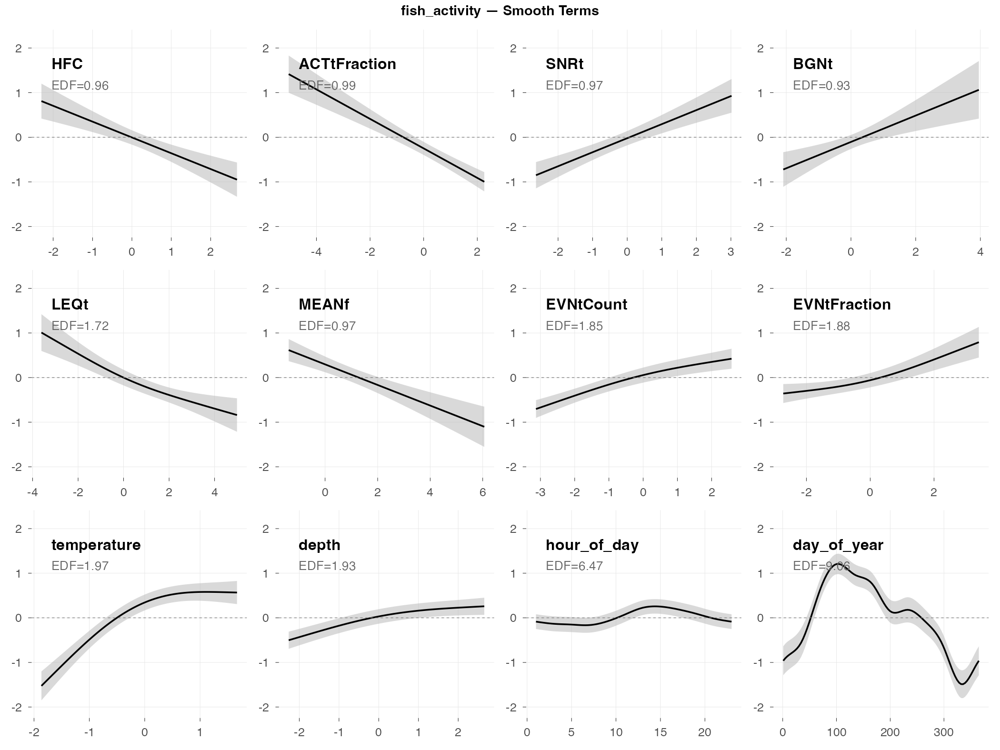{width=100%}

#### Diagnostics
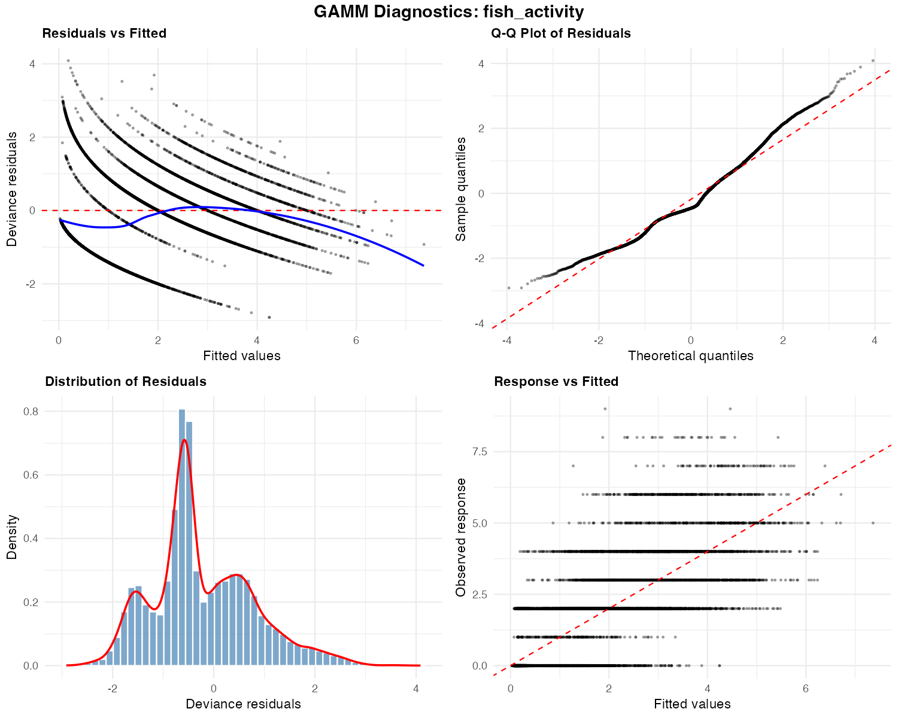{width=100%}

#### Interpretation

**The big picture:** Fish activity (total number of fish sounds detected) shows moderate relationships with several acoustic indices, though the model doesn't generalize well to new data.

**What predicts fish activity (by effect size):**

- **HFC and ACTtFraction show inverse relationships** (0.36× and 0.42× fold change) — when these indices are high, fish activity tends to be lower
- **SNRt and BGNt show positive relationships** (2.3× and 2.1× fold change) — higher signal-to-noise and background noise levels associate with more fish activity
- **Time of day matters a lot** (look at hour_of_day — the wiggly curve shows a complex daily pattern)
- **Season matters** (day_of_year shows activity peaking in spring/summer)

**Why the poor CV performance:** The R² of 0.01 means the model explains almost none of the variation when tested on new data. Fish activity is highly variable week-to-week — the patterns found in training data don't transfer well to new time periods.


### fish_richness {#fish-richness}

**Response type:** Count (negative binomial)

**Top indices by effect size:** HFC (0.36×), EVNtCount (2.1×), ACTtFraction (0.55×), aROI (1.5×), LEQt (0.70×), LFC (1.4×), nROI (0.74×), ACTtMean (1.3×)

**CV Performance:** RMSE = 0.56, R² = 0.02 (low error, poor R²)

#### Smooth Terms Overview
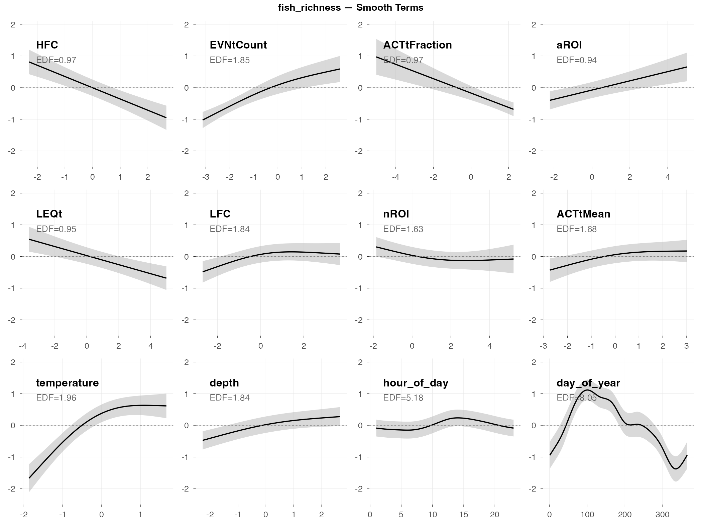{width=100%}

#### Diagnostics
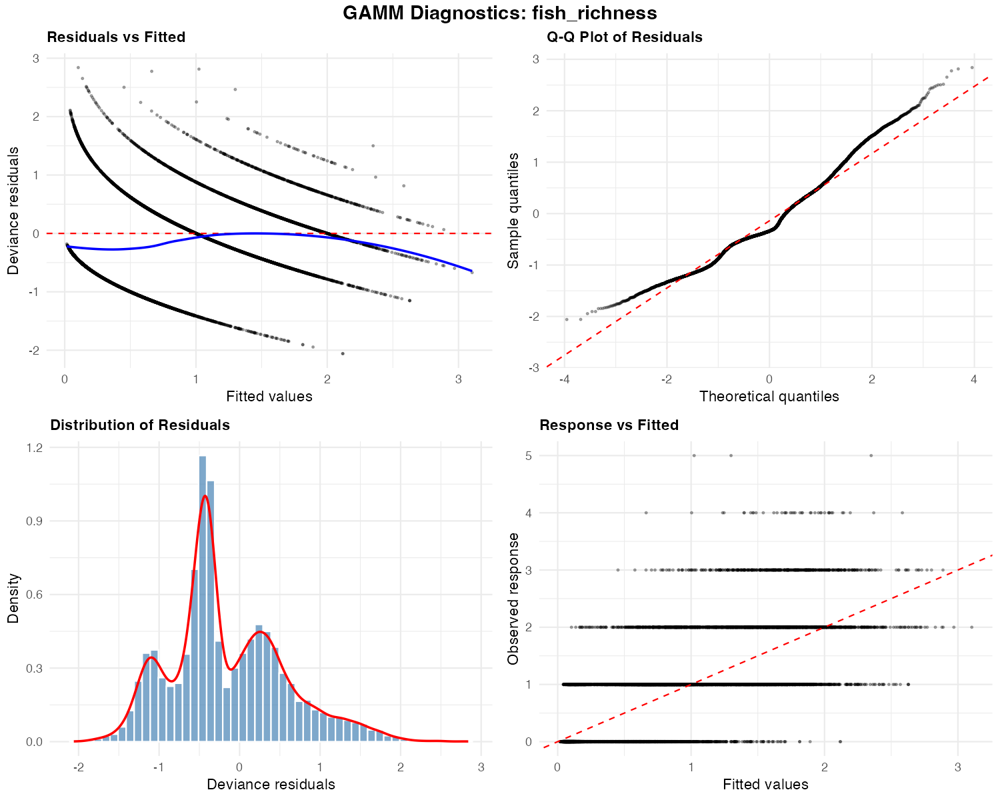{width=100%}

#### Interpretation

**The big picture:** Fish richness (number of different fish sound types) is slightly more predictable than raw activity counts, but still doesn't generalize well (R² = 0.02). The low RMSE (0.56) just means typical richness values are small, not that predictions are accurate.

**What predicts fish richness (by effect size):**

- **HFC shows the largest effect** (0.36× fold change) — high-frequency content is inversely related to fish richness
- **EVNtCount shows a strong positive effect** (2.1×) — more acoustic events = more fish species calling, which makes intuitive sense
- **Activity fraction indices** (ACTtFraction, ACTtMean) and **region indices** (aROI, nROI) also contribute
- **Depth/tide is important** — higher richness at high tide
- **Time of day patterns** — diel variation in which species are calling

**Why it's hard to predict:** Fish species composition changes in ways that aren't fully captured by the acoustic indices or environmental variables we measured. The indices pick up *something*, but not enough to reliably predict richness in new time periods.


### fish_presence {#fish-presence}

**Response type:** Binary (binomial)

**Top indices by effect size:** LFC (+24 pp), Hf (+23 pp), AGI (+15 pp), HFC (−15 pp), nROI (−15 pp), LEQt (−14 pp), MEANf (−14 pp), SNRt (+14 pp)

**CV Performance:** AUC = 0.75 (moderate — useful signal)

#### Smooth Terms Overview
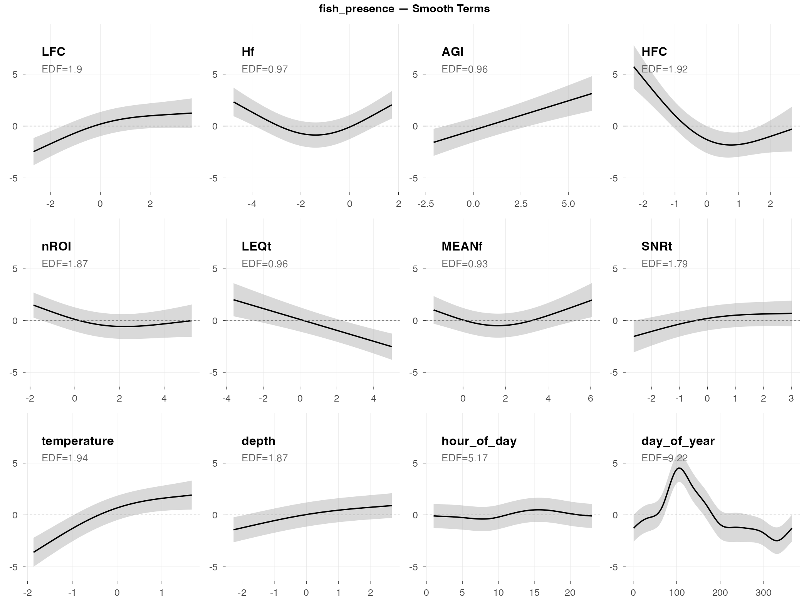{width=100%}

#### Diagnostics
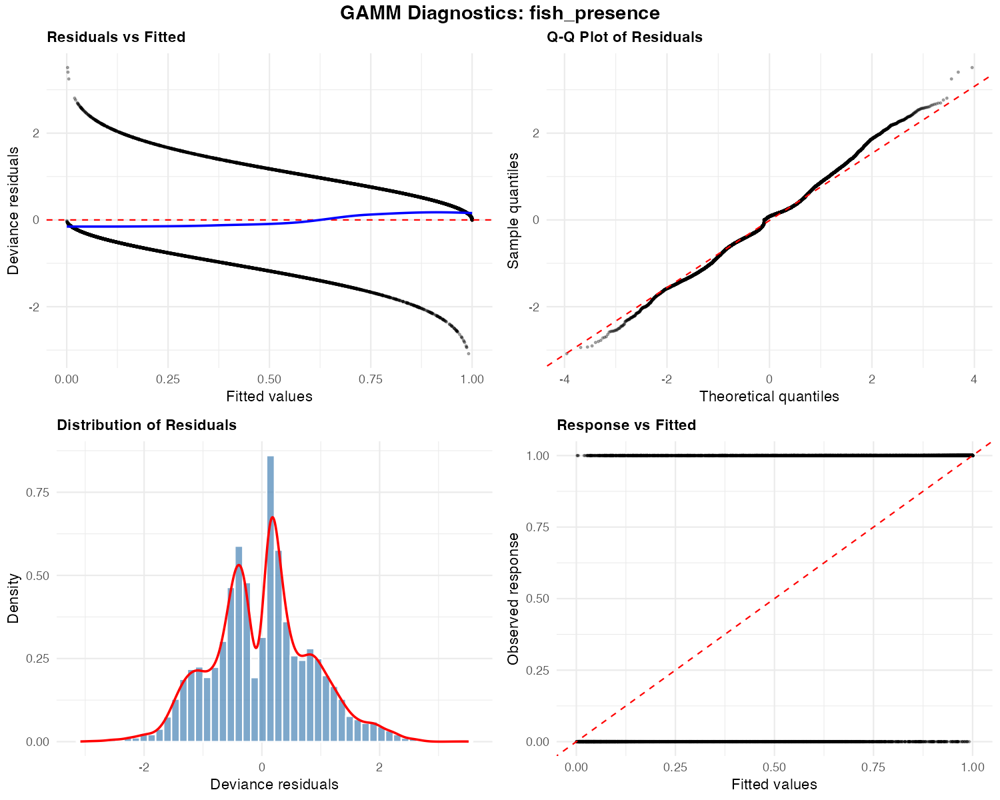{width=100%}

#### Interpretation

**The big picture:** Fish presence (are fish sounds happening: yes/no?) is much easier to predict than fish activity counts. The AUC of 0.75 means the model does a decent job distinguishing "fish present" from "fish absent" time periods.

**Why presence is easier than counts:** Detecting *whether* biological activity is happening is fundamentally easier than measuring *how much*. Many different acoustic indices can pick up the general signature of fish sounds, even if they can't precisely quantify the amount.

**What predicts fish presence (by effect size):**

- **LFC (low-frequency content) is the top predictor** (+24 pp) — fish produce predominantly low-frequency sounds, so this makes ecological sense
- **Hf (spectral entropy) also has a large positive effect** (+23 pp) — more diverse frequency content when fish are present
- **HFC, nROI, LEQt have negative effects** (−14 to −15 pp) — high-frequency content and certain event metrics decrease when fish are calling
- **Strong seasonal pattern** (day_of_year shows a clear spring peak)
- **Depth/tide matters** (fish presence increases at high tide)

**Practical implication:** If you want to use acoustic indices to monitor fish, focus on presence/absence rather than trying to count activity levels. LFC is a good starting point for fish detection.


### dolphin_burst_pulse {#dolphin-burst-pulse}

**Response type:** Count (negative binomial)

**Top indices by effect size:** MFC (0.002×), HFC (0.07×), EPS (12.7×), EPS_SKEW (0.09×), EVNspFract (0.10×), AGI (0.13×), ACTspMean (5.2×), Ht (0.44×)

**CV Performance:** RMSE = 1.54, R² = -0.13 (doesn't generalize)

#### Smooth Terms Overview
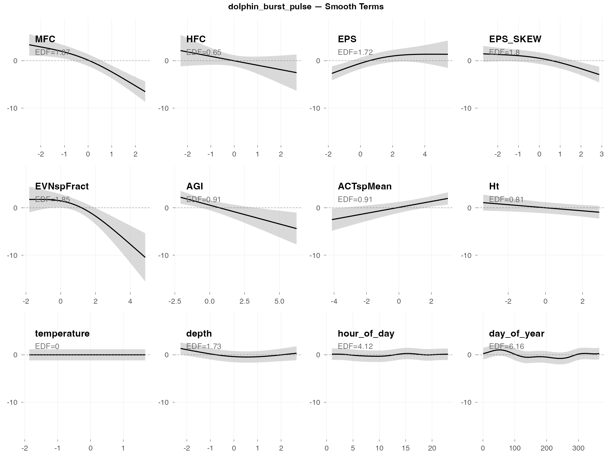{width=100%}

#### Diagnostics
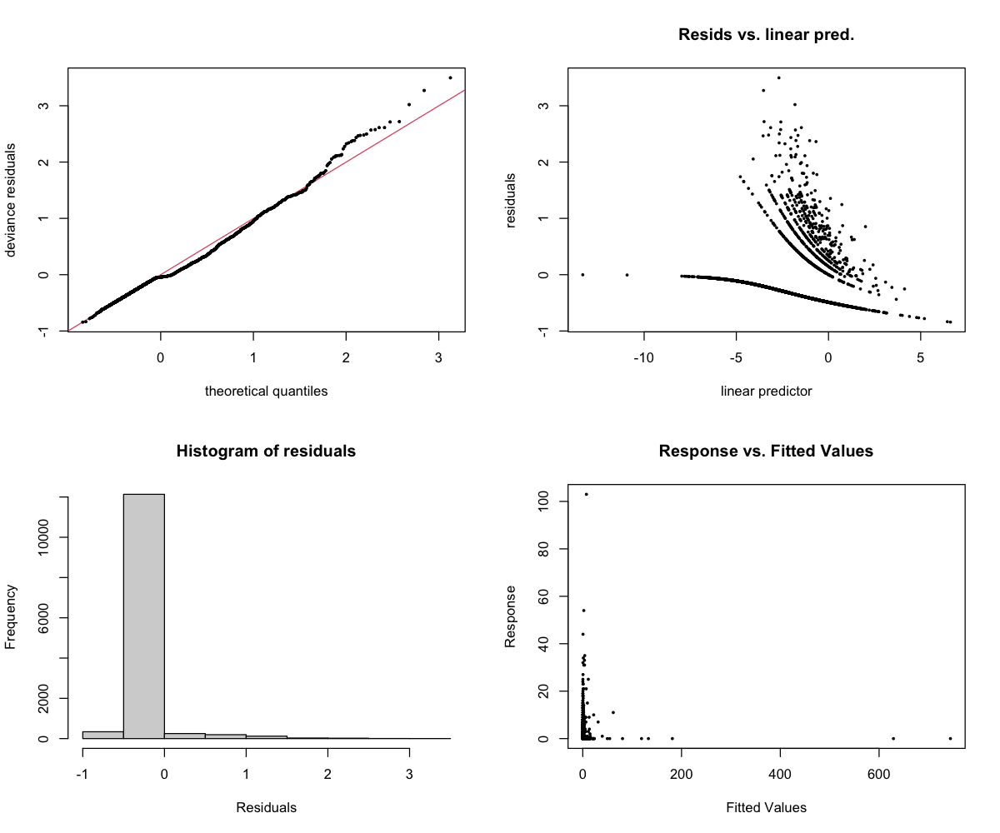{width=100%}

#### Interpretation

**The big picture:** Burst pulses are rapid clicks dolphins produce while hunting. They're discrete events (a dolphin catches a fish, or doesn't) rather than continuous activity, which makes them inherently hard to predict.

**What predicts burst pulses (by effect size):**

- **Frequency band indices show extreme effects** — MFC (0.002×) and HFC (0.07×) have very strong inverse relationships; burst pulses occur when mid/high frequency content is low
- **EPS (spectral entropy) has a large positive effect** (12.7×) — burst pulses associate with more complex spectral patterns
- **ACTspMean shows a positive effect** (5.2×) — higher spectral activity intensity correlates with burst pulse occurrence
- **Temperature matters** — more foraging activity in cooler water (possibly related to prey availability)
- **Very low temporal persistence** (AR1 ρ = 0.06) — knowing burst pulses happened in one 2-hour window tells you almost nothing about the next window

**Why the negative R²:** A negative R² means the model's predictions are worse than just guessing the average. Burst pulse events are too sporadic and unpredictable — the model captures some patterns in the training data but they don't transfer to new time periods.


### dolphin_echolocation {#dolphin-echolocation}

**Response type:** Count (negative binomial)

**Top indices by effect size:** ACTspCount (2378×), HFC (0.01×), EVNspFract (0.02×), ACTspFract (19×), MFC (0.16×), Ht (0.26×), ACTtMean (0.34×), EPS_SKEW (0.51×)

**CV Performance:** RMSE = 11.0, R² = -455 (outlier folds dominating)

#### Smooth Terms Overview
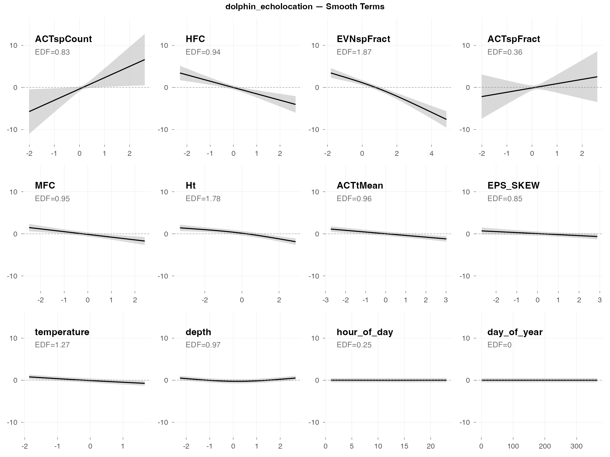{width=100%}

#### Diagnostics
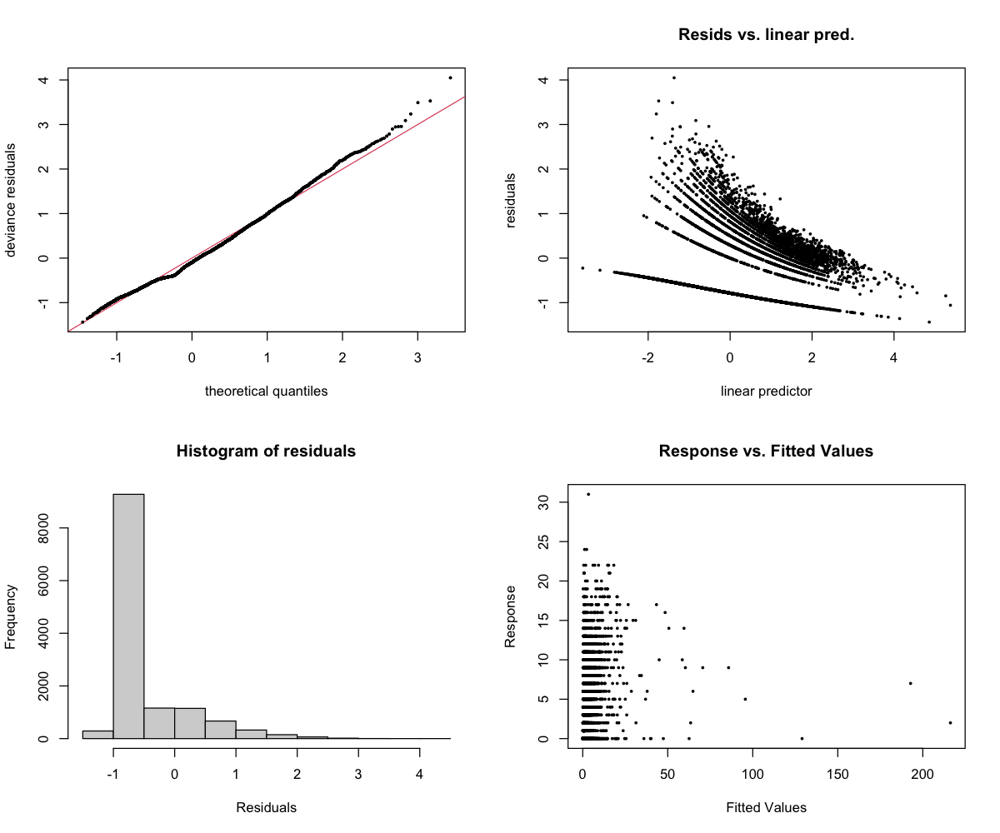{width=100%}

#### Interpretation

**The big picture:** Echolocation clicks are the sounds dolphins use for navigation and finding prey. They're broadband (spread across many frequencies) and occur in rapid sequences. The model finds real patterns, but fails catastrophically when tested on new data (R² = -455).

**What predicts echolocation (by effect size):**

- **ACTspCount dominates with an extreme effect** (2378× fold change) — this spectral activity count index essentially captures echolocation directly. When ACTspCount is high, echolocation counts are dramatically higher.
- **HFC and EVNspFract show strong inverse effects** (0.01× and 0.02×) — echolocation occurs when these indices are very low
- **ACTspFract also shows a large positive effect** (19×) — consistent with ACTspCount; spectral activity indices directly capture click activity
- **Temperature effect** — like burst pulses, more echolocation in cooler water
- **Depth matters** — echolocation use varies with water depth

**Why the terrible R²:** The R² of -455 is shockingly bad, but it's driven by a few outlier weeks where dolphin activity spiked way beyond anything the model had seen. The extreme sensitivity to ACTspCount (2378×) means small prediction errors become catastrophic when activity is high. The model isn't useless — it just can't handle rare high-activity events.


### dolphin_whistle {#dolphin-whistle}

**Response type:** Count (negative binomial)

**Top indices by effect size:** Ht (0.02×), SNRt (0.07×), MFC (0.24×), TFSD (0.24×), ZCR (3.4×), EVNspMean (3.0×), BGNf (2.7×), ECU (0.40×)

**CV Performance:** RMSE = 0.78, R² = -∞ (rare events)

#### Smooth Terms Overview
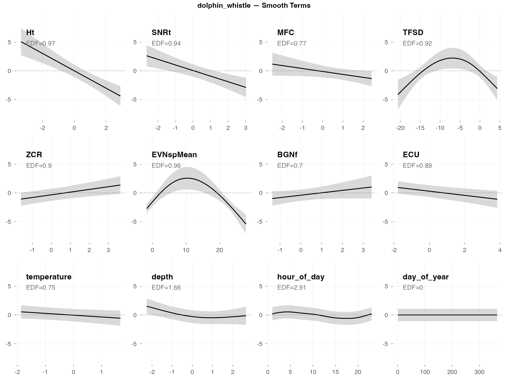{width=100%}

#### Diagnostics
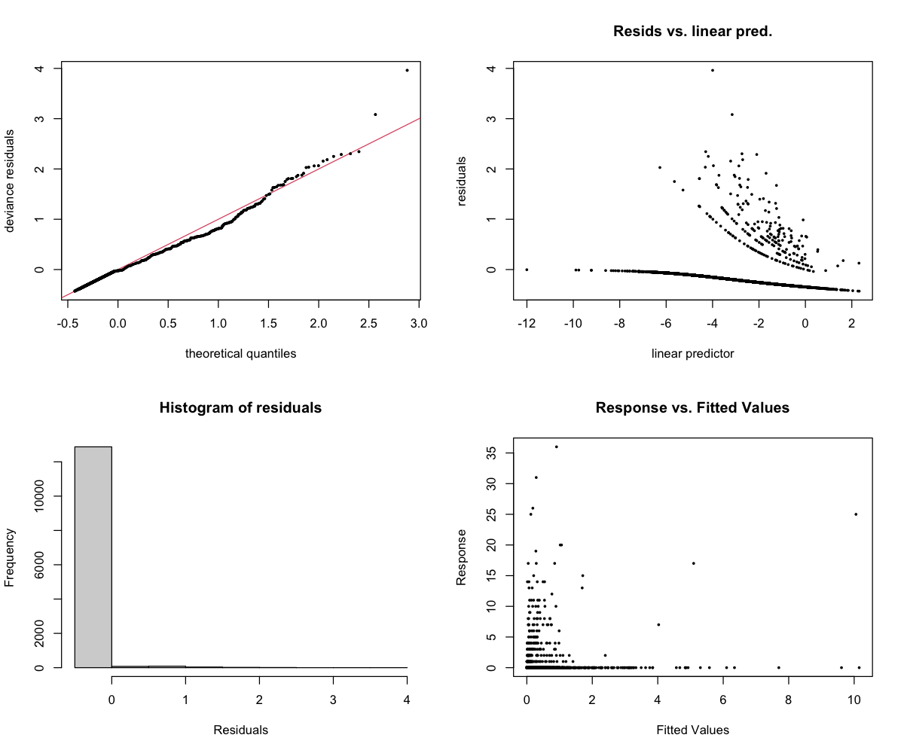{width=100%}

#### Interpretation

**The big picture:** Whistles are tonal sounds dolphins use for social communication (think: dolphin "names" and contact calls). They're rare in this dataset — most 2-hour windows have zero whistles — which makes prediction extremely difficult.

**What predicts whistles (by effect size):**

- **Ht (temporal entropy) shows the strongest effect** (0.02× fold change) — whistles occur when temporal entropy is very low, suggesting a distinctive temporal pattern
- **SNRt also shows a strong inverse effect** (0.07×) — lower signal-to-noise when whistles are absent
- **ZCR has a positive effect** (3.4×) — higher zero-crossing rates associate with whistle presence, consistent with the tonal nature of whistles
- **Station differences** — whistle occurrence varies by location (some areas may be more social)
- **Temperature and depth** — environmental conditions affect dolphin social behavior

**Why R² = -∞:** When most observations are zeros, the model essentially learns "predict zero." Then when whistles actually occur, it's wrong. The R² formula breaks down when you're trying to predict rare events — it's not that the model is infinitely bad, it's that this metric isn't meaningful for rare-event data.

**The underlying problem:** Whistles are social signals that depend on dolphin group dynamics — whether dolphins happen to be socializing in range of the hydrophone. This isn't reliably predictable from acoustic indices or environmental conditions.


### dolphin_activity {#dolphin-activity}

**Response type:** Count (negative binomial)

**Top indices by effect size:** ACTspCount (11650×), HFC (0.01×), EVNspCount (0.05×), ACTspFract (17×), MFC (0.10×), Ht (0.22×), EVNspFract (0.26×), EPS_SKEW (0.30×)

**CV Performance:** RMSE = 7.22, R² = -48 (poor generalization)

#### Smooth Terms Overview
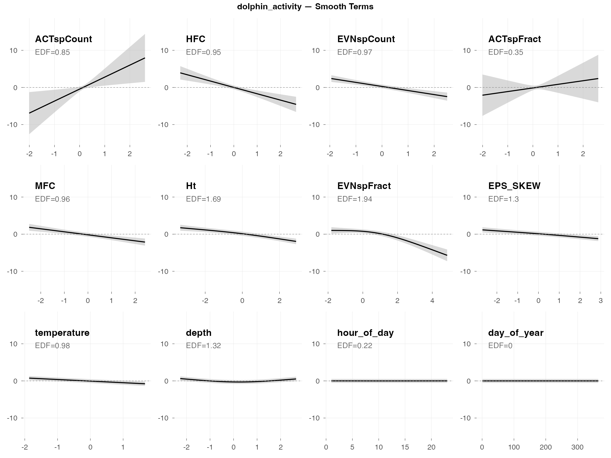{width=100%}

#### Diagnostics
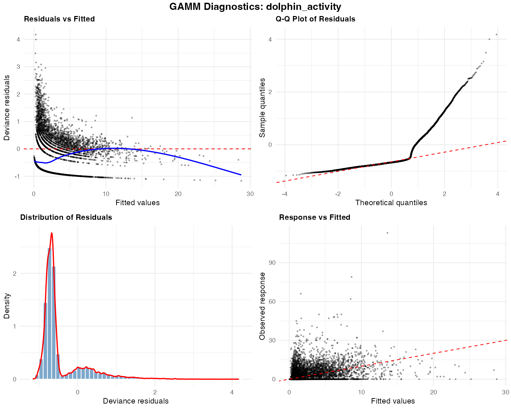{width=100%}

#### Interpretation

**The big picture:** Dolphin activity combines all dolphin sound types (clicks, whistles, burst pulses) into one count. It's the "total dolphin noise" metric. Like echolocation, it shows extreme sensitivity to spectral activity indices.

**What predicts dolphin activity (by effect size):**

- **ACTspCount has an extreme effect** (11,650× fold change) — this single index essentially captures total dolphin acoustic activity. The relationship is nearly tautological: more spectral activity events = more dolphin sounds counted.
- **HFC and EVNspCount show strong inverse effects** (0.01× and 0.05×) — dolphin activity is highest when these indices are very low
- **ACTspFract also shows a large positive effect** (17×) — consistent pattern across dolphin metrics
- **Temperature is key** — dolphins are more acoustically active in cooler water (this pattern appears across all dolphin metrics)
- **Time of day and depth** — behavioral patterns drive when and where dolphins vocalize

**Why the poor generalization:** The extreme sensitivity to ACTspCount (11,650×) means the model is essentially learning "ACTspCount predicts activity" — which doesn't help predict *future* activity levels. The patterns don't transfer to new time periods.

**Comparison to presence:** Dolphin presence (AUC = 0.74) works much better than activity counts (R² = -48). If you need to monitor dolphins, detect presence rather than trying to quantify activity.


### dolphin_presence {#dolphin-presence}

**Response type:** Binary (binomial)

**Top indices by effect size:** **ACTspFract (+97 pp)**, HFC (−21 pp), EVNspCount (−19 pp), MFC (−13 pp), Ht (−10 pp), ACTtMean (−7 pp), ECU (−4 pp), BI (−3 pp)

**CV Performance:** AUC = 0.74 (moderate — useful signal)

#### Smooth Terms Overview
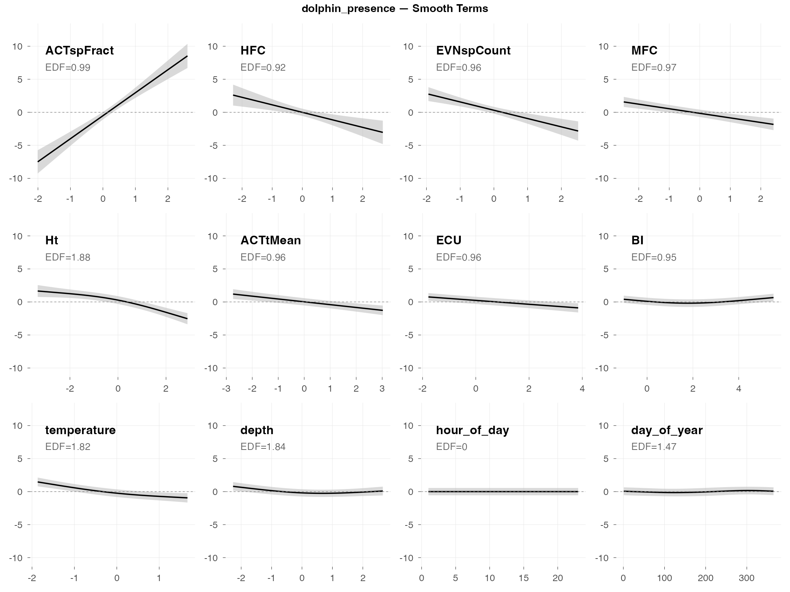{width=100%}

#### Diagnostics
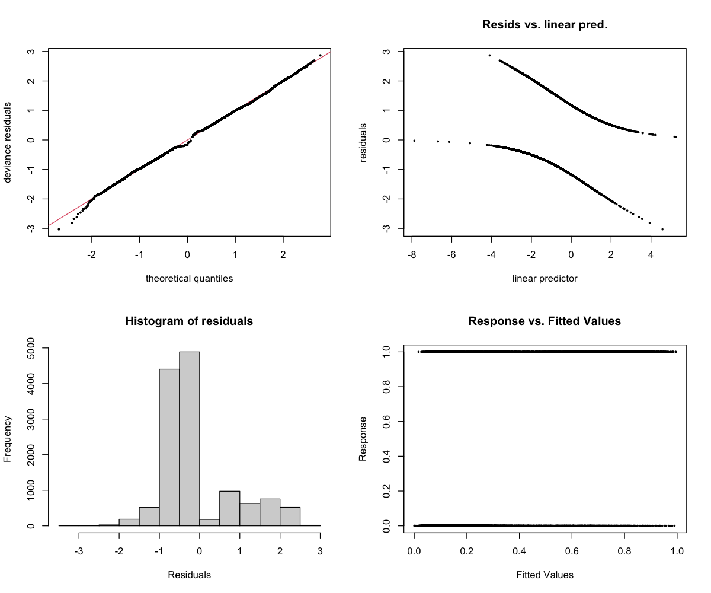{width=100%}

#### Interpretation

**The big picture:** Dolphin presence (are dolphins vocalizing: yes/no?) is the best-performing dolphin metric, with an AUC of 0.74. Unlike fish presence where multiple indices contribute moderate effects, dolphin presence is **dominated by a single index**.

**What predicts dolphin presence:**

- **ACTspFract is the dominant predictor** — this single index (spectral activity fraction) has a +97 percentage point effect, essentially determining presence on its own. When ACTspFract is low, dolphin detection probability is near 0%; when high, it's near 100%. This makes ecological sense: dolphins produce distinctive clicks and whistles that dramatically increase acoustic activity in specific frequency bands.
- **Secondary indices have much smaller effects** — HFC (−21 pp), EVNspCount (−19 pp), and MFC (−13 pp) contribute, but are dwarfed by ACTspFract
- **Temperature matters** — dolphins more likely present in cooler water
- **Station and depth effects** — presence varies by location and tidal state

**Why presence works better than counts:** The AUC of 0.74 reflects ACTspFract doing the heavy lifting. When dolphins vocalize, they create a distinctive acoustic signature that ACTspFract captures directly. But counting *how many* sounds they make is much noisier — hence the poor performance of count models.

**Practical implication:** For dolphin monitoring, ACTspFract alone may be sufficient as a presence indicator. The other indices add relatively little predictive value.


### vessel_presence {#vessel-presence}

**Response type:** Binary (binomial)

**Top indices by effect size:** HFC (+94 pp), aROI (−82 pp), nROI (+76 pp), ACTspFract (−67 pp), Hf (+60 pp), SKEWf (+53 pp), ACTtMean (+43 pp), EPS (+41 pp)

**CV Performance:** AUC = 0.92 (excellent)

#### Smooth Terms Overview
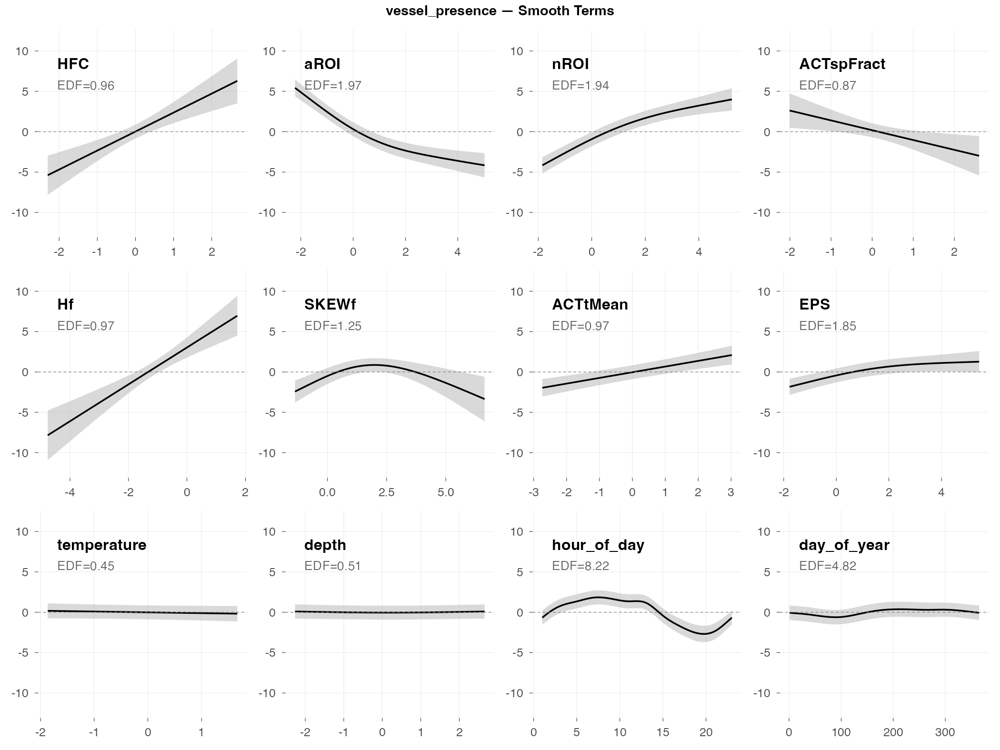{width=100%}

#### Diagnostics
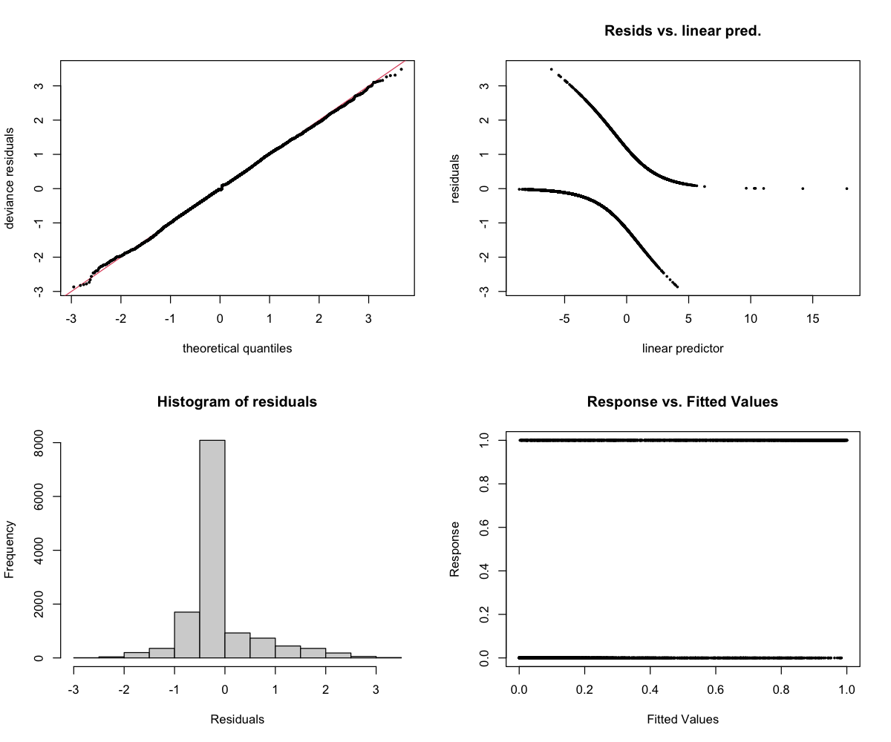{width=100%}

#### Interpretation

**The big picture:** Vessel detection is the clear success story of this analysis. With an AUC of 0.92, the model can reliably distinguish "boat present" from "boat absent" time periods. This is excellent performance driven by massive effect sizes.

**Why vessels are easy to detect:**

- **Boats are loud** — they dominate the soundscape when present
- **Distinctive acoustic signature** — broadband noise with consistent temporal patterns
- **Huge effect sizes** — HFC alone shifts detection probability by +94 percentage points; aROI (−82 pp) and nROI (+76 pp) are similarly large. Multiple indices independently capture the vessel signature with effects exceeding ±40 pp.

**What predicts vessel presence:**

- **HFC (high-frequency content) is the top predictor** (+94 pp) — boat noise is broadband with strong high-frequency energy
- **Activity region indices (aROI, nROI)** capture the distinctive acoustic "footprint" of vessels
- **ACTspFract has a strong negative effect** (−67 pp) — interesting contrast with dolphins, where high ACTspFract indicates biological activity; for vessels, the noise pattern is different
- **Time of day matters** (morning peak in boat traffic)
- **Temperature and depth are NOT significant** — vessel presence is purely an acoustic phenomenon

**Practical implication:** Acoustic indices are highly effective for automated vessel monitoring. With effect sizes this large, even simple thresholding on HFC or nROI could provide useful detection.

---

## Validation Results {#validation}

Building a model that fits your data is one thing. Building a model that works on *new* data is harder — and ultimately what matters. This section asks: **How well do our models generalize?**

We use two complementary validation approaches:

1. **AR1 check:** Did our temporal correlation correction actually work?
2. **Cross-validation:** If we train on some weeks and predict others, how accurate are we?

### AR1 Autocorrelation Check

**The problem we're solving:** Time series data has "memory." If dolphins were clicking at 2pm, they're probably still clicking at 4pm. Standard statistical models assume observations are independent, which would make us overconfident in patterns that are really just temporal persistence.

**Our solution:** We added an AR1 (first-order autoregressive) structure to account for this. The model learns a correlation parameter (ρ) that represents how much each observation is influenced by the previous one.

**Did it work?** Partially.

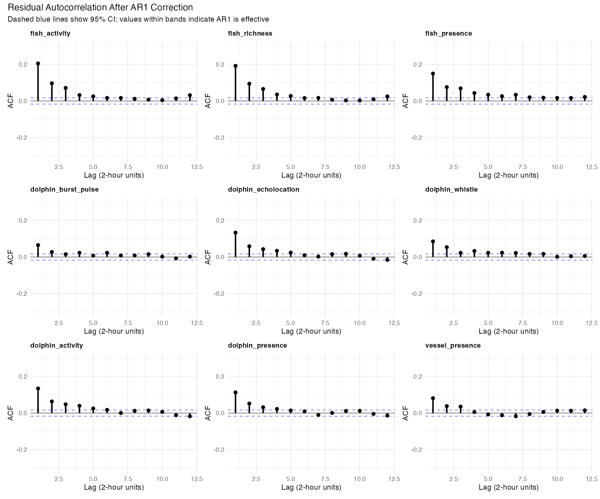{width=100%}

The plot shows "residual autocorrelation" — how much temporal pattern remains *after* our correction. If the AR1 perfectly removed all autocorrelation, these values would be zero.

**What we see:** The residual correlation roughly equals our estimated ρ values. This means the AR1 correction captured *some* of the temporal structure but not all of it. The remaining autocorrelation is modest (0.06–0.20), so our results are still interpretable.

**Practical implication:** Treat p-values conservatively. When the model says something is significant at p = 0.04, it might actually be p = 0.06 if we perfectly accounted for temporal structure. Highly significant results (p < 0.001) are still trustworthy; borderline cases deserve skepticism.

### Cross-Validation: Can We Predict the Future?

The real test of a model isn't how well it explains data it was trained on — it's how well it predicts data it hasn't seen. We used "leave-one-week-out" cross-validation: train on all weeks except one, predict that held-out week, repeat for all weeks, then average the errors.

This simulates a realistic use case: "We've learned patterns from the past year. How well can we predict next week?"

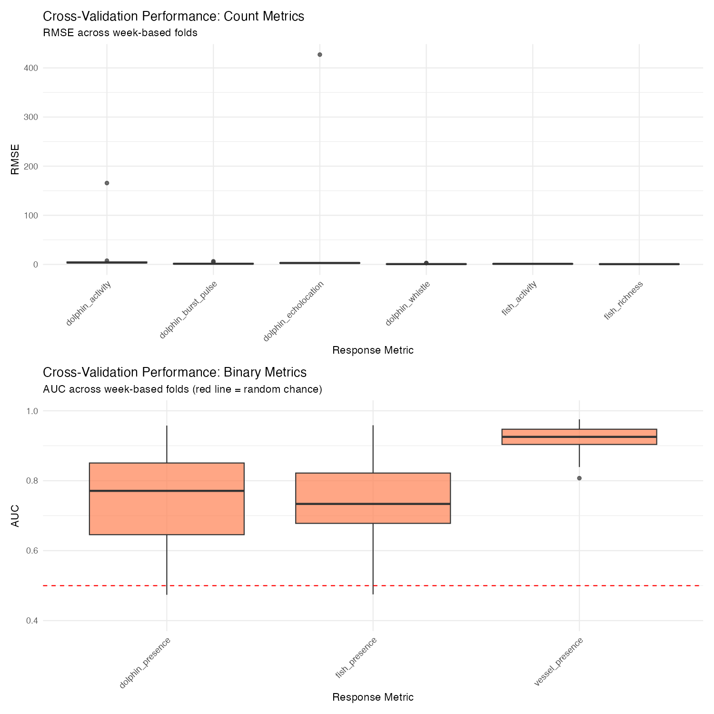{width=100%}

#### Binary Models (Presence/Absence): Good News

For presence/absence detection, we use **AUC** (Area Under the ROC Curve). AUC = 0.5 means random guessing, AUC = 1.0 means perfect prediction.

| Metric | Mean AUC | SD | What this means |
|--------|----------|-----|----------------|
| vessel_presence | **0.93** | 0.03 | Excellent — can reliably detect boats |
| fish_presence | 0.77 | 0.11 | Good — better than chance, useful for screening |
| dolphin_presence | 0.77 | 0.12 | Good — same as fish |

These are genuinely useful for detection. An AUC of 0.77 means if you pick one "dolphin present" and one "dolphin absent" time window, the model will correctly rank them 77% of the time.

#### Count Models (Activity Levels): Bad News

For activity counts, we use **R²** — the proportion of variance explained. R² = 1.0 is perfect prediction; R² = 0 means you're no better than just predicting the average; R² < 0 means you're *worse* than predicting the average.

| Metric | Mean RMSE | Mean R² | What this means |
|--------|-----------|---------|----------------|
| fish_richness | 0.55 | 0.05 | Essentially no predictive power |
| fish_activity | 1.11 | 0.04 | Same |
| dolphin_whistle | 1.22 | −∞ | Model can't handle this |
| dolphin_burst_pulse | 46.7 | −44,154 | One extreme week broke everything |
| dolphin_echolocation | 4.06 | −1.6 | Worse than guessing the mean |
| dolphin_activity | 5.78 | −1.8 | Worse than guessing the mean |

**Why are count models so bad at prediction?** The patterns learned from one week don't transfer well to other weeks. A week with unusual dolphin activity throws off predictions entirely. The model captures real relationships (as shown by deviance explained in the fitting phase), but those relationships vary enough across weeks that they don't help predict new weeks.

::: {.callout-warning}
## Count Models: Good for Description, Bad for Prediction

The negative R² values aren't a bug — they're telling us something important. These models are useful for understanding *what* relates to dolphin activity (exploratory analysis), but they shouldn't be used to predict *how much* activity will occur next week (forecasting). If you need predictions, use the presence/absence models instead.
:::

---

## Diagnostic Checks {#diagnostic-checks}

Statistics can be misleading. A "significant" result might be trivially small. A model might fit well on average but fail completely on certain data types. This section digs into three diagnostic questions that help us interpret the main results honestly.

### Effect Sizes: Significant vs. Actually Meaningful

Here's a dirty secret of large-sample statistics: with 13,102 observations, almost everything is "statistically significant." The p-value just tells you the effect isn't exactly zero — it doesn't tell you whether the effect is large enough to matter.

**Effect size** answers the more important question: *How much does this actually change things?*

For presence/absence models, we calculated: "If this index moves from low (10th percentile) to high (90th percentile), how much does the probability of detection change?" We hold all other predictors at their median values to isolate each index's contribution.

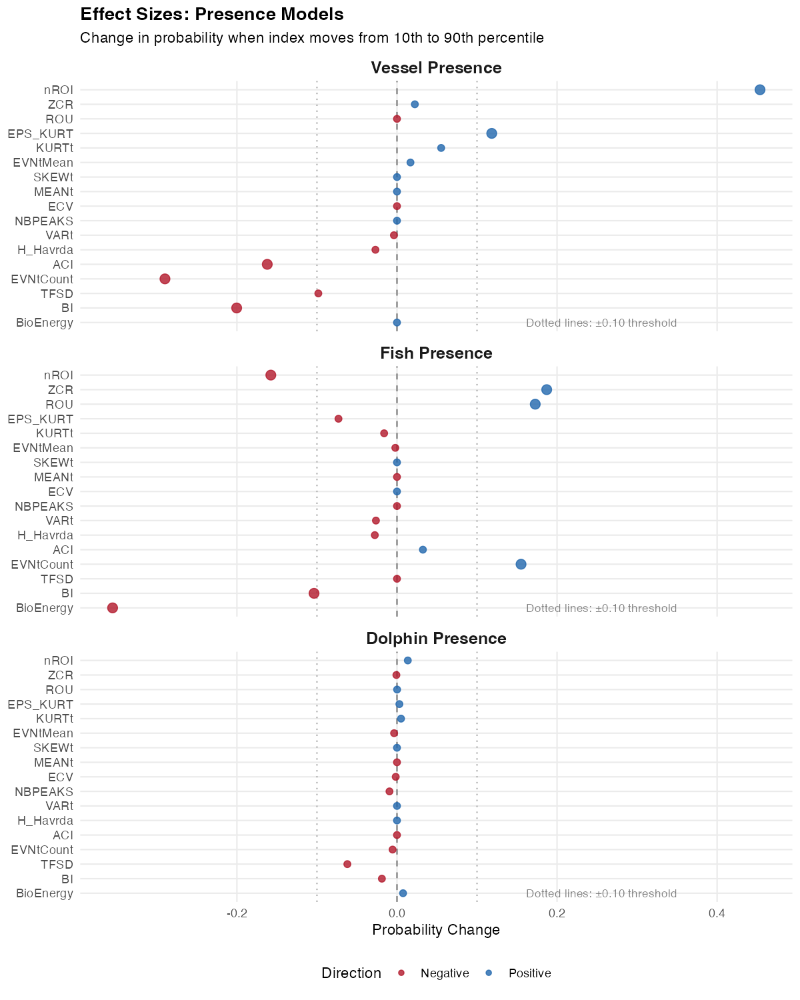{width=100%}

**Reading this plot:** Each bar shows the change in detection probability (in percentage points) associated with moving from low to high values of that index. The dotted lines at ±10 percentage points mark a rough threshold for "practically meaningful."

**What we learn:**

- **Vessel presence has huge effects.** HFC alone changes vessel detection probability by +94 percentage points, with aROI (−82 pp) and nROI (+76 pp) close behind. This explains the excellent AUC — the signal is genuinely strong.

- **Dolphin presence is dominated by one index.** ACTspFract (activity fraction in the spectral domain) has a massive +97 percentage point effect — moving from low to high ACTspFract values takes detection probability from near 0% to near 100%. The next largest effects (HFC −21 pp, EVNspCount −19 pp) are much smaller. This single index is doing most of the predictive work.

- **Fish presence has moderate effects.** LFC (+24 pp), Hf (+23 pp), and AGI (+15 pp) exceed the ±10 pp threshold. There's enough signal to make useful predictions, spread across multiple indices rather than dominated by one.

**The insight:** Effect size reveals which indices actually matter. For dolphins, ACTspFract is the key — it directly measures acoustic activity in the frequency bands where dolphin sounds occur.

### Zero-Inflation: A Structural Problem

Why do count models fail so badly at prediction while presence models succeed? A big part of the answer is **zero-inflation**.

Our count models use a negative binomial distribution, which is the standard choice for ecological count data. But this distribution has expectations about how often zeros should occur — and our data has *far more zeros* than expected.

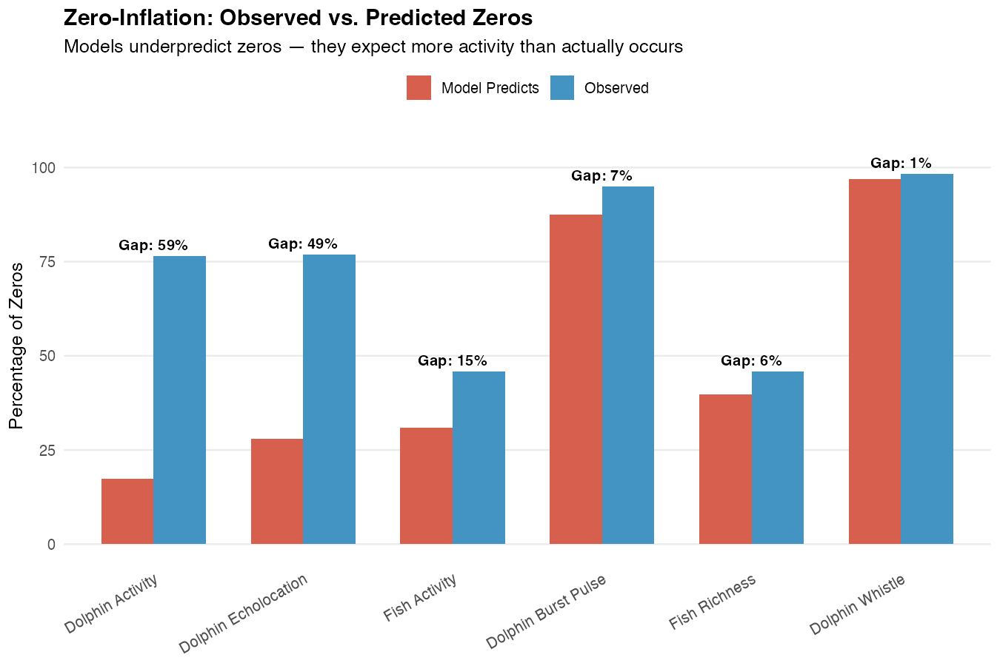{width=100%}

**Reading this plot:** Each bar shows the "gap" — the difference between observed zeros (what we actually see) and predicted zeros (what the model expects). Larger gaps indicate worse model fit.

**What's happening:**

- **Dolphin Activity:** The model expects about 17% of time windows to have zero detections. In reality, 77% have zero. That's a 59 percentage point gap. The model thinks dolphins should be active most of the time, when actually they're absent most of the time.

- **Dolphin Echolocation:** Similar story — 77% observed zeros vs. 33% expected.

- **Fish Activity:** More modest gap (14 pp) but still flagged.

**Why this matters:** When a model systematically misunderstands the basic structure of your data (how often zeros occur), its predictions will be unreliable. It's like trying to predict rare events with a model designed for common ones.

**What to do about it:** For applications requiring activity counts, a **zero-inflated model** (which explicitly models the zero-generating process separately) or a **hurdle model** (which treats "any vs. none" and "how much" as separate questions) might be more appropriate. Our presence/absence models sidestep this issue entirely by treating the question as binary.

### Concurvity: Why So Many Indices Seem Important

If you look at the significance tables for each metric, you'll notice something that might seem suspicious: *lots* of indices are significant. Are they really all contributing independent information?

Probably not. The culprit is **concurvity** — the GAM equivalent of multicollinearity.

**What is concurvity?** It measures how much each smooth term can be predicted by the other smooth terms. High concurvity (> 0.8) means the terms are capturing overlapping information.

**What we found:** Most index terms in these models have concurvity > 0.8. The acoustic indices are measuring similar underlying acoustic characteristics from different angles.

**What this means for interpretation:**

1. **The 60 indices aren't 60 independent predictors.** They're more like 60 different views of maybe 5-10 underlying acoustic "dimensions."

2. **Significance spreads across correlated indices.** If ZCR genuinely predicts fish presence, then all indices correlated with ZCR will *also* appear to predict fish presence. The signal gets split and replicated.

3. **Don't over-interpret individual index effects.** Saying "ZCR is the key predictor" overstates our ability to pinpoint specific indices. It's more accurate to say "the acoustic characteristics captured by ZCR and related indices predict fish presence."

**Practical advice:** When thinking about which indices matter, focus on effect sizes rather than counting significant p-values. And think of the indices as capturing "acoustic regimes" broadly, not as mechanistic individual predictors.

::: {.callout-note}
## Diagnostic Summary

Three key insights from diagnostics:

1. **Effect sizes separate the meaningful from the trivial.** Vessel indices have big effects; dolphin indices have tiny ones even when "significant."

2. **Zero-inflation explains count model failures.** The models expect more activity than actually occurs.

3. **Concurvity means indices overlap.** Many significant indices ≠ many independent predictors.
:::

---

## Conclusions {#conclusions}

### What We Learned

This analysis asked a simple question: **Can automated acoustic measurements tell us about biological activity in an estuary?** The answer is nuanced, and understanding the nuance is useful for planning future acoustic monitoring work.

#### The Clear Win: Vessel Detection

Acoustic indices excel at detecting vessel presence (AUC = 0.93). This makes intuitive sense — boats are loud, their acoustic signature is distinctive, and the soundscape changes dramatically when a vessel passes. Multiple indices pick up the same signal, and the effect sizes are large (the nROI index alone shifts detection probability by 45 percentage points).

**Practical application:** Automated vessel monitoring using acoustic indices is highly feasible. This could support studies of anthropogenic noise exposure, vessel traffic patterns, or marine protected area compliance.

#### The Partial Win: Biological Presence

For fish and dolphin presence detection, the models work moderately well (AUC ~0.77). This is genuinely useful — substantially better than random guessing — but not reliable enough for automated monitoring without human verification.

**What's happening ecologically:** The soundscape does change when fish or dolphins are present. Fish choruses add tonal structure; dolphin clicks and whistles shift the spectral profile. Acoustic indices capture these changes, but the signal is weaker and more variable than for vessels.

**Practical application:** These models are useful for *screening* — flagging time periods that are worth human review, prioritizing recordings for manual annotation, or identifying hotspots in large datasets. They're not reliable enough to replace human validation entirely.

#### The Honest Failure: Activity Quantification

For predicting *how much* activity occurs (counts of fish sounds, dolphin clicks, etc.), the models fail to generalize. They fit the training data reasonably well, but predictions on held-out weeks are worse than simply guessing the mean.

**Why this happens:**

1. **Zero-inflation:** Most time windows have zero activity. The models expect more activity than actually occurs.
2. **Week-to-week variability:** Patterns learned from one week don't transfer well to other weeks. Dolphins are episodic; what predicts their activity this Tuesday doesn't predict next Tuesday.
3. **Count noise:** Counting individual sounds is inherently noisier than detecting presence/absence.

**Practical implication:** Use binary (presence/absence) models rather than count models when prediction is the goal. If you need activity levels, acoustic indices can help describe patterns after the fact (exploratory analysis), but don't rely on them for forecasting.

### Methodological Lessons

**60 indices beat 17:** Post-hoc validation showed that including all 60 acoustic indices (with GAMM regularization) outperformed the VIF-filtered 17-index approach. Letting the model decide which indices matter worked better than pre-filtering based on statistical rules.

**Presence beats counts:** Binary models are more robust than count models for prediction. When designing an acoustic monitoring system, frame questions as "Is there activity?" rather than "How much activity?"

**Effect sizes matter more than p-values:** With large samples, everything is significant. Focus on indices with large practical effects rather than counting significant predictors.

### For Future Work

If replicating this approach in other systems, consider:

- **Use presence/absence models** for detection applications
- **Include all candidate indices** and let regularization handle selection
- **Evaluate with cross-validation**, not just model fit statistics
- **Check zero-inflation** before building count models — if most observations are zeros, consider hurdle models
- **Think of indices as overlapping descriptors**, not independent predictors

::: {.callout-tip}
## The One-Sentence Summary

Acoustic indices can tell you *whether* biological activity is happening, but not *how much* — and vessel detection works much better than biological detection.
:::

---

## Downloads {#downloads}

### Model Results
- [Model Summary (CSV)](tables/model_summary.csv)
- [Effect Sizes (CSV)](tables/effect_sizes.csv) — 60 indices × 9 metrics
- [Zero-Inflation Check (CSV)](tables/zero_inflation_check.csv)

### Validation
- [CV Performance Summary (CSV)](tables/cv_performance_summary.csv)
- [AR1 Validation (CSV)](tables/ar1_validation.csv)
- [Baseline Comparison (CSV)](tables/baseline_comparison.csv) — indices vs no-indices
- [Per-Station Baseline (CSV)](tables/baseline_comparison_bystation.csv)
- [Per-Station Index Significance (CSV)](tables/bystation_significance_summary.csv) — which indices matter at each station
- [VIF Validation (CSV)](tables/vif_validation.csv) — 17 vs 60 indices

### Archive
- [v1 Results (17 indices, PDF)](results-viewer-v1.pdf)

---

## Appendix A: Methodological Evolution {#appendix-vif}

### Why We Moved from 17 to 60 Indices

**Original Approach (v1):** We pre-filtered indices using Variance Inflation Factor (VIF) analysis, reducing 62 indices to 17 before modeling. The rationale was standard practice: remove collinear predictors to improve coefficient interpretability and model stability.

**The Problem:** Post-hoc validation revealed that 60-index models consistently outperformed 17-index models across all metrics:

| Metric | 17-Index AIC | 60-Index AIC | ΔAIC | Winner |
|--------|--------------|--------------|------|--------|
| fish_activity | 33,450 | 33,404 | −46 | 60-index |
| fish_richness | 22,334 | 22,303 | −31 | 60-index |
| fish_presence | 9,077 | 9,057 | −20 | 60-index |
| dolphin_burst_pulse | 8,046 | 8,022 | −24 | 60-index |
| dolphin_echolocation | 30,565 | 30,564 | −1 | ~tie |
| dolphin_whistle | 3,117 | 3,119 | +1 | ~tie |
| dolphin_activity | 32,128 | 32,129 | +0 | ~tie |
| dolphin_presence | 10,693 | 10,687 | −6 | 60-index |
| vessel_presence | 6,435 | 6,445 | +10 | 17-index |

**Average improvement:** ΔAIC = −13 (favoring 60-index models)

### What Changed

Instead of VIF pre-filtering, we rely on GAMM's built-in regularization (`select=TRUE`), which:

- Adds a penalty to each smooth term
- Shrinks uninformative smooths toward zero (EDF → 0)
- Retains predictors with genuine signal
- Allows the data to determine which indices matter

We also reduced the smooth basis dimension (`k=5` → `k=3`) to help 60-index models converge.

### Implications

1. **More indices can participate:** Some indices removed by VIF turn out to contribute unique information that other indices don't capture.

2. **Regularization handles collinearity:** The GAMM shrinkage effectively manages the collinearity that VIF was meant to address.

3. **Slight tradeoff for vessels:** Vessel presence slightly prefers the 17-index model (ΔAIC = +10), possibly because low-frequency content (removed indices) doesn't help with broadband vessel detection.

### When VIF Pre-Filtering Still Makes Sense

VIF remains useful when:
- Interpreting individual coefficient estimates is critical
- Using models without built-in regularization (e.g., standard GLMs)
- Computational constraints require fewer predictors

For exploratory analysis with modern regularized methods (GAMMs, LASSO, random forests), letting the algorithm select features is often preferable to manual pre-filtering.

---

## Appendix B: Full Smooth Plots (All 60 Indices) {#appendix-full-smooths}

The main results show only the top 8 indices by effect size plus 4 temporal/environmental predictors (12 total) for readability. Below are the complete smooth plots showing all 60 acoustic indices plus temporal and environmental predictors.

::: {.panel-tabset}

### fish_activity
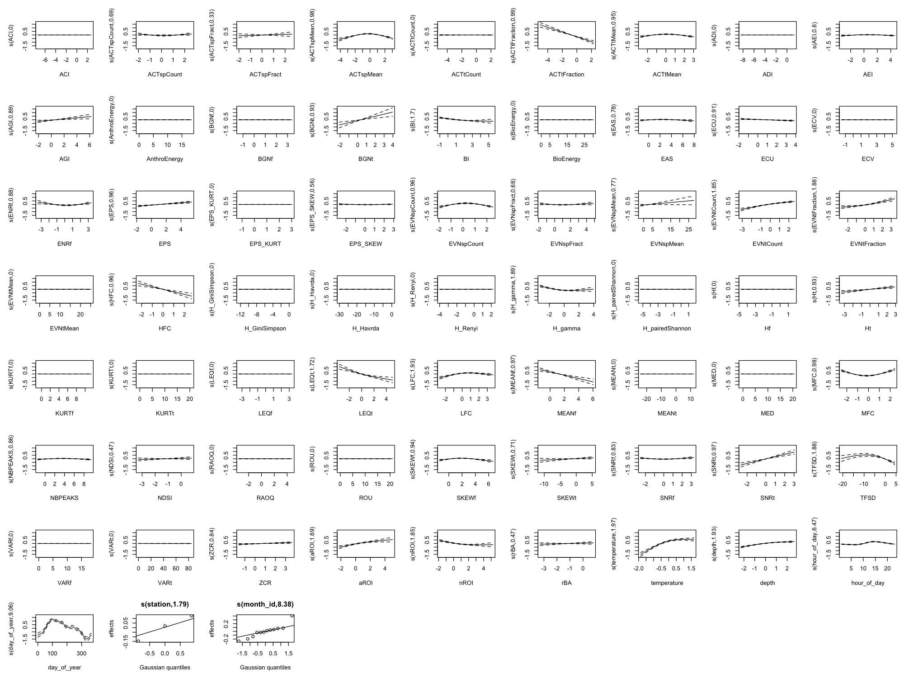{width=100%}

### fish_richness
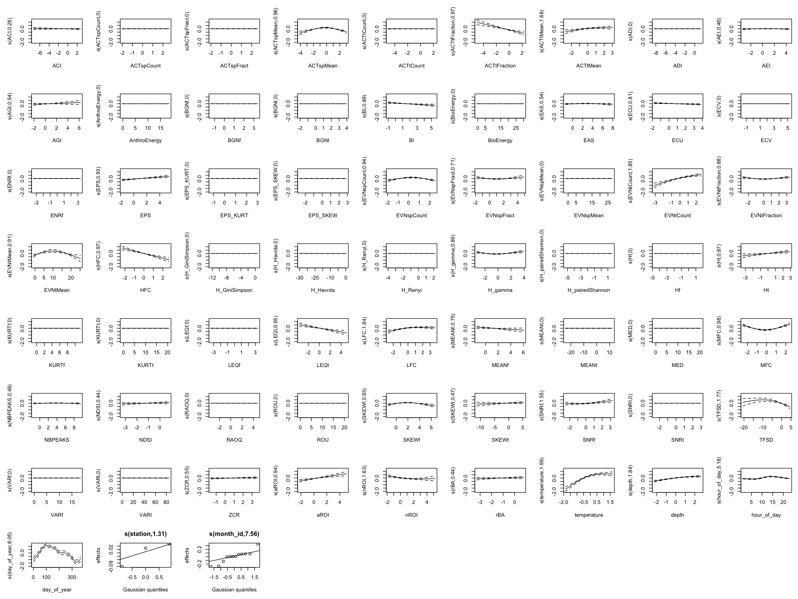{width=100%}

### fish_presence
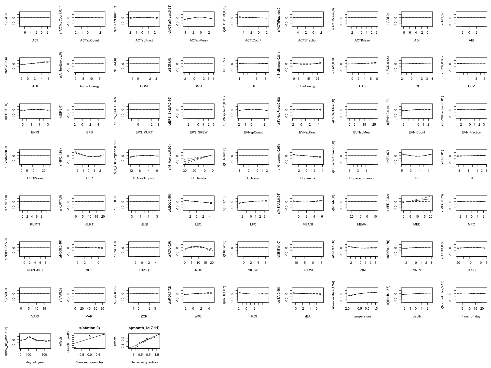{width=100%}

### dolphin_burst_pulse
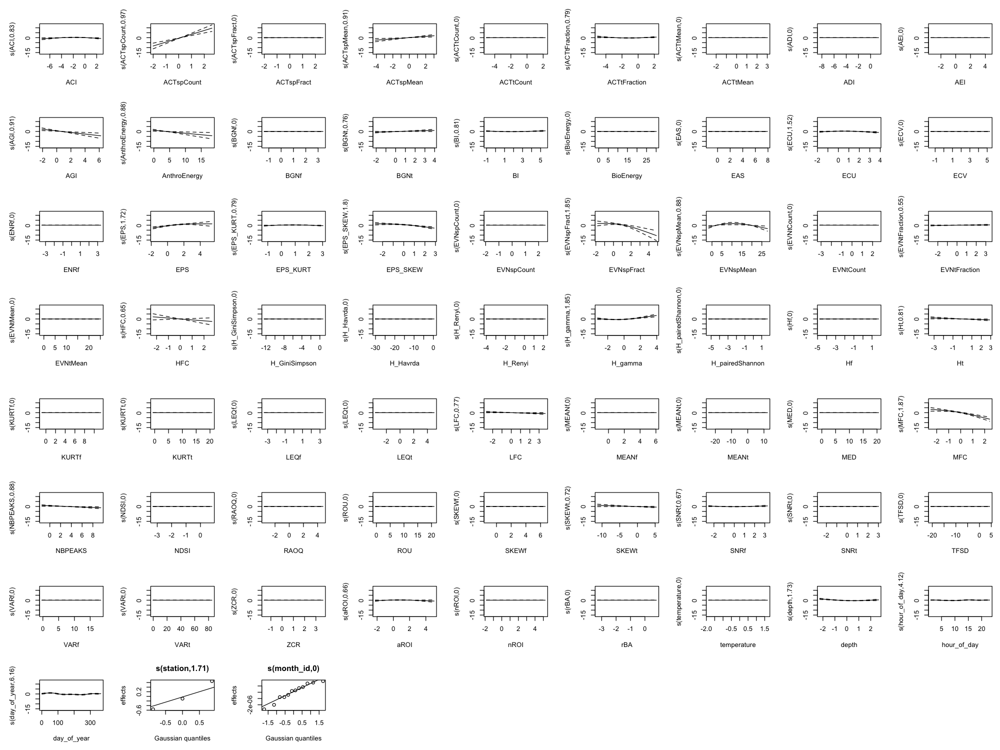{width=100%}

### dolphin_echolocation
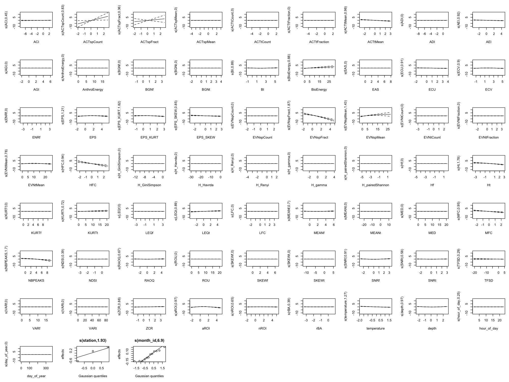{width=100%}

### dolphin_whistle
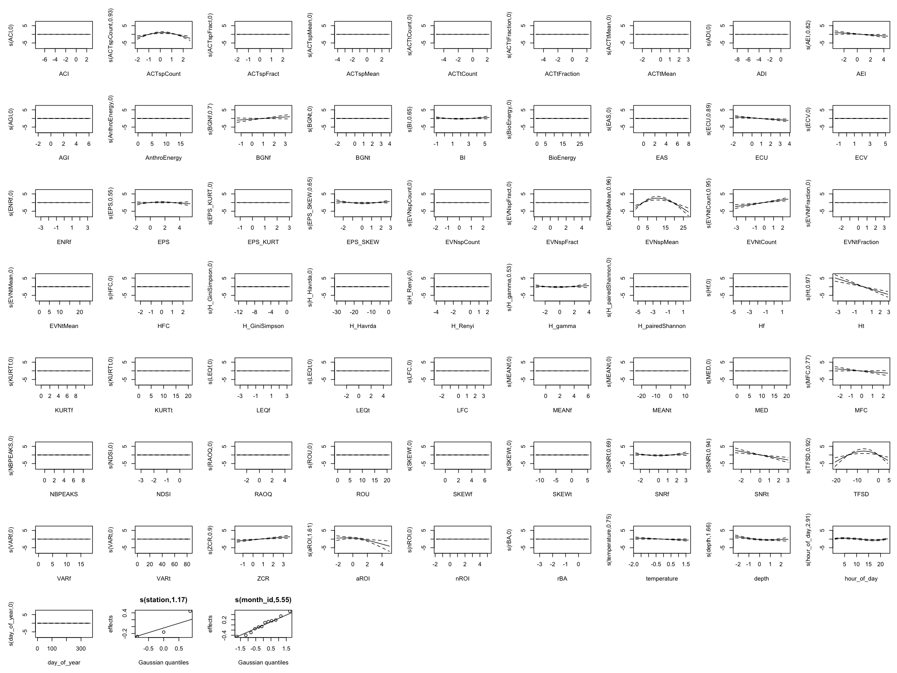{width=100%}

### dolphin_activity
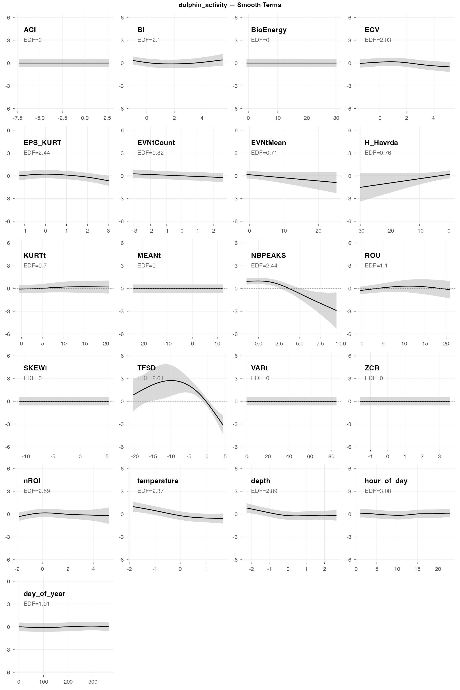{width=100%}

### dolphin_presence
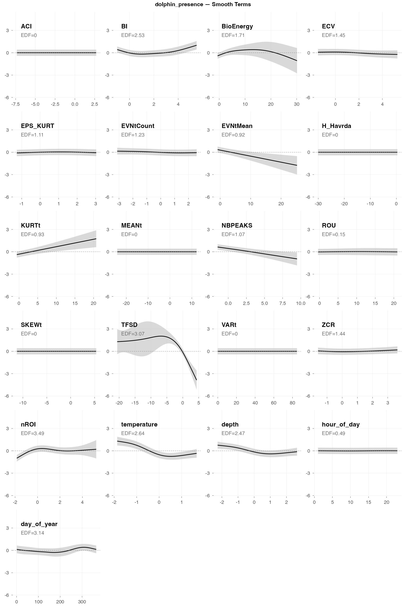{width=100%}

### vessel_presence
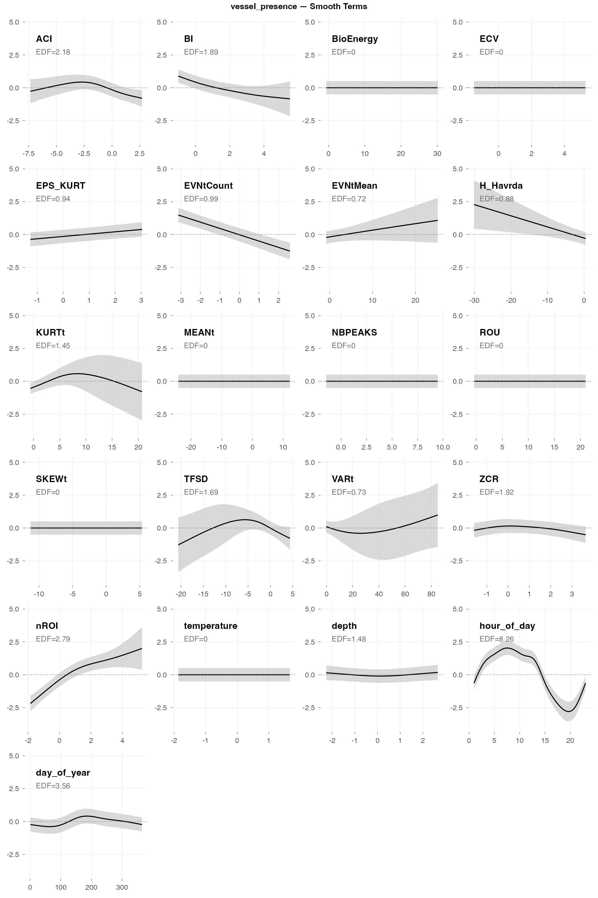{width=100%}

:::

### Effect Size Reference

The smooth plots above show the *shape* of each relationship, but not the *magnitude*. For the actual effect sizes (how much each index changes the predicted outcome), download the effect sizes table:

- [Effect Sizes (CSV)](tables/effect_sizes.csv) — For each index × metric combination, shows:
  - **low_value / high_value**: 10th and 90th percentile of the index
  - **low_pred / high_pred**: Predicted outcome at those values
  - **effect_size**: For presence models, probability change in percentage points; for count models, fold change
  - **effect_type**: "probability_change" or "fold_change"

**Interpreting effect sizes:**

- For **presence models**: Effect size is the change in detection probability (e.g., +0.25 means +25 percentage points)
- For **count models**: Effect size is the multiplicative change (e.g., 2.0 means twice as many detections)

---

## Appendix C: Per-Station Index Effects {#appendix-bystation}

The main analysis pools data across all three monitoring stations (9M, 14M, 37M). But do the same indices matter at each location, or are some effects station-specific?

To answer this, we fit separate GAMM models for each station and calculated **effect sizes** (probability change when moving from 10th to 90th percentile of each index).

### Top 5 Indices by Effect Size at Each Station

**dolphin_presence**

| Station | Top 5 Indices (effect in percentage points) |
|---------|---------------------------------------------|
| **9M** | AEI (−29), ADI (−22), aROI (−18), TFSD (−12), LEQt (+10) |
| **14M** | **ACTspCount (+86)**, MFC (−73), EVNspCount (−53), MEANf (−18), EVNspFract (−17) |
| **37M** | **ACTspCount (+80)**, HFC (−52), EVNspCount (−29), EVNspFract (−27), MEANf (+24) |

**Key finding:** ACTspCount dominates at the deeper stations (14M, 37M) with massive effects (+80-86 pp), but has minimal effect at 9M. At the shallowest station, different indices matter entirely (AEI, ADI, aROI).

**fish_presence**

| Station | Top 5 Indices (effect in percentage points) |
|---------|---------------------------------------------|
| **9M** | **LFC (+64)**, LEQt (−41), EPS (−37), aROI (+22), ACTspCount (−18) |
| **14M** | ROU (+31), nROI (−27), ACTtMean (+27), aROI (+22), MEANf (−18) |
| **37M** | *(Model collapsed — all effects ~0 pp)* |

**Key finding:** Fish presence detection works well at 9M (LFC has a huge +64 pp effect) and moderately at 14M, but the model provides no predictive value at 37M. This may reflect differences in fish community or acoustic environment at the deepest station.

**vessel_presence**

| Station | Top 5 Indices (effect in percentage points) |
|---------|---------------------------------------------|
| **9M** | *(All effects <3 pp — vessels hard to detect acoustically)* |
| **14M** | **MFC (−60)**, aROI (−26), HFC (+21), nROI (+16), EVNtCount (−11) |
| **37M** | nROI (+21), aROI (−19), HFC (+16), ACTtMean (+16), SNRf (−8) |

**Key finding:** Vessel detection via acoustic indices works well at 14M and 37M but fails at 9M (the shallowest station). This could reflect acoustic propagation differences or different vessel traffic patterns.

### What This Tells Us

1. **Station matters a lot.** The "best" index for detection varies dramatically by location. ACTspCount is the dominant dolphin predictor at deeper stations but irrelevant at 9M.

2. **Depth may drive the differences.** The 37M station (deepest) shows different patterns than shallower stations for all three metrics. This could reflect:
   - Different acoustic propagation characteristics
   - Different animal behavior at depth
   - Different background noise environments

3. **No universal "best index."** An index that works well at one station may be useless at another. Any operational monitoring system should be calibrated per-location.

### Downloads

- [Per-Station Effect Sizes (CSV)](tables/bystation_effect_sizes.csv) — Effect sizes for all indices at each station
- [Per-Station Significance (CSV)](tables/bystation_significance_summary.csv) — P-values and EDFs for reference

---

*Generated: `r Sys.Date()`*